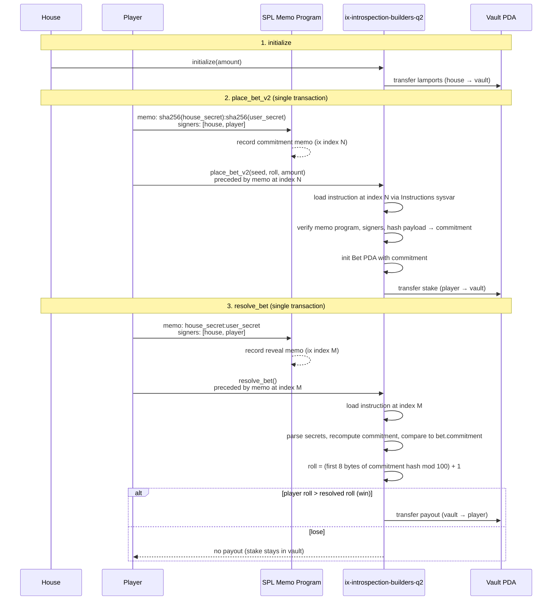

# ix-introspection-builders-q2

A Solana dice-betting program where the house and player commit to randomness **before** a bet is placed, then reveal secrets at resolution. The program uses **instruction introspection** (reading the previous instruction in the transaction via the Instructions sysvar) to capture commitments and secrets from SPL Memo instructions without storing secrets on-chain at bet time.

The player picks a target roll (1–99) and stakes lamports into a house vault. At resolve time, both parties reveal their secrets; the program recomputes the commitment, derives a fair roll from the hash, and pays out if the player's target beats the roll.

---

## Program instructions

| Instruction | Purpose |
|-------------|---------|
| `initialize` | House deposits lamports into a PDA vault (`seeds = ["vault", house]`) to fund payouts. |
| `place_bet` | Creates a bet PDA and transfers stake to the vault. Stores a **zero** commitment (no memo validation). |
| `place_bet_v2` | Same as `place_bet`, but reads the **previous** instruction in the transaction, validates it is a signed SPL Memo containing both parties' **hash commitments**, and stores that hash on the bet account. |
| `resolve_bet` | Reads the **previous** memo instruction containing both **plaintext secrets**, recomputes the commitment, derives the roll, and pays the player if they win. |
| `refund_bet` | After 1000+ slots since the bet was placed, refunds the stake from the vault back to the player and closes the bet account. |

### Bet account

Each bet is a PDA (`seeds = ["bet", vault, player, seed]`) storing:

- `player`, `seed`, `slot`, `amount`, `roll` (target), `bump`
- `commitment` — 32-byte hash binding house + player randomness (set by `place_bet_v2`)

Constants: min bet 0.01 SOL, roll range 1–99, house edge 1.5% (150 basis points).

---

## Happy path sequence



---

## Commitment scheme and roll derivation

This is the core of `place_bet_v2` + `resolve_bet`. Neither party can change their randomness after the bet is placed, and neither can learn the other's secret until resolve—while still allowing the program to verify consistency on-chain.

### Phase 1 — Commit (at `place_bet_v2`)

Before calling `place_bet_v2`, the client sends a **pre-instruction** memo in the same transaction:

```
memo data: "<hex_sha256(house_secret)>:<hex_sha256(user_secret)>"
signers:   [house, player]
```

The program uses the Instructions sysvar to read the instruction at `current_index - 1` and validates:

1. Program ID is SPL Memo.
2. Exactly two accounts, matching house and player pubkeys.
3. Memo data is UTF-8, split on `:` into two parts.
4. Commitment stored on the bet:

```
combined = part0_bytes || part1_bytes   // raw hex strings concatenated
commitment = sha256(combined)
```

At this point only **hashes** of the secrets are on-chain (inside the memo, then hashed again into `bet.commitment`). Plaintext secrets are not stored.

### Phase 2 — Reveal (at `resolve_bet`)

Before calling `resolve_bet`, the client sends another pre-instruction memo:

```
memo data: "<house_secret>:<user_secret>"
signers:   [house, player]
```

The program again reads `current_index - 1` and validates the same memo shape. It then:

1. Parses `house_secret` and `user_secret` from the memo.
2. Recomputes what the commitment **should** have been at place time:

```
house_hash_hex = hex(sha256(house_secret))
user_hash_hex  = hex(sha256(user_secret))
recomputed     = sha256(house_hash_hex_bytes || user_hash_hex_bytes)
```

3. Requires `recomputed == bet.commitment`. If either party lied about their secret, the hash will not match and the transaction fails with `InvalidCommitment`.

### Phase 3 — Roll from commitment bytes

Once the commitment is verified, the same 32-byte value is used as the randomness source:

```
roll = (u64_from_le_bytes(commitment[0..8]) % 100) + 1   // range 1..=100
```

The player wins if their stored target `bet.roll > roll` (strictly under-style bet: "I bet the roll will be below my number"). Payout uses parimutuel-style odds with house edge:

```
payout = amount * (10000 - 150) / (bet.roll - 1) / 100
```

### Why memo + instruction introspection?

- **Co-signing**: Both house and player must sign the memo, proving agreement on the committed/revealed payload.
- **Ordering**: Introspection ties the memo to the immediately following program instruction, so commitments cannot be swapped or replayed from another transaction.
- **No secret storage**: Secrets never touch program state at place time; only the commitment hash is persisted on the bet account.

### `place_bet` vs `place_bet_v2`

`place_bet` is the legacy path: it writes a zero commitment and skips memo validation. The commitment-based flow described above requires `place_bet_v2` and paired memo pre-instructions, as exercised in the integration tests.

---

## Building and testing

```bash
anchor build
surfpool start
anchor test
```

The test suite airdrops SOL to house and player, initializes the vault, places a bet via `place_bet_v2` with commitment memos, then resolves with secret memos.
